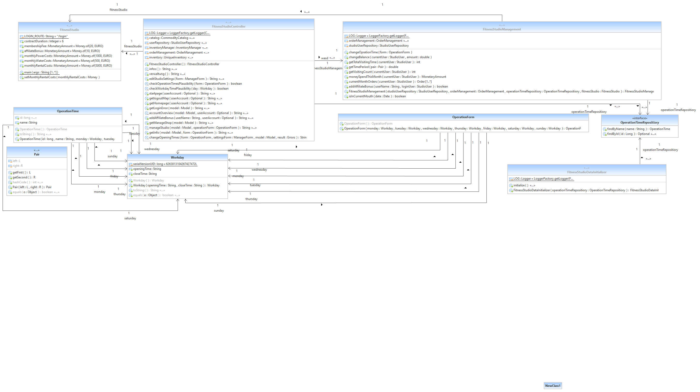

[options="header"]
[cols="1, 1, 1, 1, 4"]
|===
|Version | Status      | Bearbeitungsdatum   | Autoren(en) |  Vermerk
|0.1     | abgeschlossen   | 29.11.2020          | Nils       | Initiale Version
|0.2     | abgeschlossen   | 29.11.2020          | Nils       | Erfüllung der Qualitätsziele
|0.3     | abgeschlossen   | 29.11.2020          | Daniel     | Weitesgehend vervollständigt
|0.4     | abgeschlossen   | 30.11.2020          | Daniel     | Frameworknutzung vervollständigt
|0.5     | abgeschlossen   | 1.12.2020           | Daniel     | Package-Diagramme hinzugefügt
|0.6     | abgeschlossen   | 31.01.2021          | Daniel     | Update zur finalen Version, Ergänzungen, Diagramme hinzugefügt
|===

:project_name: Fitnessstudio
:toc: left
:numbered:

= Entwicklerdokumentation

== Einführung und Ziele

=== Aufgabenstellung
Fitnessstudio
Es soll eine Software für den Einsatz in einem Fitnessstudio entwickelt werden.
Dabei sollen verschiedene Geschäftsfelder berücksichtigt werden.
In der Mitarbeiterverwaltung können Mitarbeiter des Fitnessstudios eingestellt, bearbeitet
und entlassen werden. Die Mitarbeiter haben verschiedene Aufgaben/Rechte und Löhne.
Für jedes Mitarbeiter wird am Monatsende ein Lohnschein per PDF ausgestellt. Die
Mitarbeiter sollen einen eigenen Login erhalten, um ihre Lohnscheine abzurufen sowie
Urlaubsanträge zu stellen und deren Status einzusehen.
Mitglieder sollen sich über ein Formular anmelden können und nach Abschluss eines
Vertrages als vollwertiges Mitglied aufgenommen werden. Die Mitglieder können von
Mitarbeitern bearbeitet und entlassen werden. Die Mitglieder erhalten nach der Anmeldung einen Account sich einzuloggen. In ihrem Account können sie ihre persönlichen Daten anpassen und ihre monatlichen Vorgänge des Kundenkontos per PDF
ausgeben lassen.

Des Weiteren gibt es im Studio einen Eingangs- und Verkaufsbereich. Dort meldet sich
jedes Mitglied bei Betreten des Studios an und bei Verlassen ab. An der Theke können
auch Getränke, Nahrungsergänzungsmittel oder Zubehör erworben werden, diese
werden bar bezahlt oder direkt vom Kundenkonto abgebucht. Diese Artikel sollen in der
monatlichen Rechnung mit ersichtlich sein, falls sie vom Kundenkonto abgebucht werden.
Die Mitglieder können ihr Kundenkonto in ihrem Account per Überweisung aufladen. Der
monatliche Mitgliedsbeitrag wird vom Kundenkonto abgebucht. Wirbt ein Mitglied ein
neues Mitglied wird ihm ein bestimmter Betrag auf sein Kundenkonto gutgeschrieben.
Eine Mitgliedschaft kann pro Jahr für einen Monat ohne Gründe ausgesetzt werden.
Die Artikel des Verkaufsbereiches müssen sich ebenfalls verwalten lassen. Es
müssen Artikel hinzugefügt, bearbeitet und gelöscht werden können. Bei
unterschreiten der Mindestmenge müssen die Artikel auf eine Nachbestellliste
eingetragen werden welche sich als PDF ausgeben lassen soll. Artikel die für den
Verzehr gedacht sind, haben ein Verfallsdatum. Die Nachbestellliste sowie die
Überprüfung des Mindesthaltbarkeitsdatums sollen per Knopfdruck angestoßen werden
können. Für verschiedene Artikel soll man für einen bestimmten Zeitraum einen Rabatt
angeben können.

Ebenfalls sollen Statistiken über laufende Kosten, Einnahmen, Kundenverhalten und
Verkaufsartikel grafisch dargestellt werden. Verschiedene Einstellungen wie
Vertragslaufzeit, monatliche Gebühren, Neuwerbungsprämie, Öffnungszeiten usw. sollen
sich einfach global verändern lassen.

Das System wird verwendet, um die Beziehung zu Kunden zu vereinfachen, sodass sich 
Kunden bequem über die Website registrieren, persönliche Informationen verwalten und 
es Managern bequem machen können, das Fitnessstudio zu verwalten. Das neue IT-System 
soll seinen Geschäftskunden einen Wettbewerbsvorteil verschaffen.

=== Qualitätsziele (Prioritäten: 1-5, 5 ist Maximum)

// See http://asciidoctor.org/docs/user-manual/#tables
[options="header"]
|===
|Priorität |Stichwort |Beschreibung
|5 |Funktionalität | alle geforderten Funktionen sind ausführbar
|4 |Zuverlässigkeit | Das System muss ohne große Fehler durchgehend laufen
|3 |Nutzbarkeit | Für alle Stakeholders nutzbar
|1 |Effizienz | läuft ressourcenoptimiert
|4 |Wartbarkeit | leicht wartbar
|2 |Kompatibilität/Flexibilität | Kompatibel mit allen Browsern
|===

Funktionalität::
Beschreibt das Maß an Funktionalitäten, welches das Programm zum aktuellen Stadpunkt bereitstellt. 
Wie zuverlässig diese Funktionalitäten zu jenem Zeitpunkt sind ist jedoch nicht inbegriffen.

Zuverlässigkeit::
Gibt an, wie zuverlässig das Programm zum aktuellen Zeitpunk ist. Ein hohes Maß an Zuverlässigkeit
suggeriert ein geringes Maß an Fehlern und Problemen, welche bei der Nutzung der Software auftreten
könnten.

Nutzbarkeit::
Sie gibt an, wie umfangreich die Funktionalitäten für die einzelnen Benutzergruppen sind.
Ein hohes Maß an Nutzbarkeit bringt also nahezu alle gewünschten Funktionalitäten für die
einzelnen Benutzer mit sich.

Wartbarkeit::
Ist ein Maß für die Gründlichkeit der Umsetzung der aktuellen Software. Woraus sich der Aufwand
ableitet, welcher für die Erweiterung und Instandhaltung des Projektes anfällt.

Kompatibilität/Flexibilität::
Gibt an wie Plattformunabhängig die Anwendung genutzt werden kann. Eine hohe Flexibilität
bedeutet, dass alle Benutzergruppen problemlos auch mit ihren Mobilgeräten von der Anwendung
profitieren können. Ohne dabei auf Funktionalitäten verzichten zu müssen, welche nur mit
bestimmten Geräten kompatibel sind.

== Randbedingungen
=== Hardware-Vorgaben
* Server
* Computer
* Maus
* Tastatur

=== Vorgaben zum Betrieb der Software
Folgende SOftware ist notwendig um die Anwendung zu nutzen.
Ein Webbrowser ihrer Wahl

* Google Chrome
* Mozilla Firefox
* Opera
* Microsoft Edge

=== Produktnutzung

* Es soll eine Webanwendung / Webseite für ein Fitnessstudio entstehen
* Diese soll dem Fitnessstudio zur Verfügung stehen um Verwaltungsaufgaben zu ermöglichen
* Fungiert als permanente Webpräsenz für das Fitnessstudio
* Wird genutzt von den Mitgliedern und den Mitarbeitern des Fitnessstudios im Desktopbetrieb
* Die Webanwendung soll auf allen gängigen Browsern laufen
* Alle Daten werden in einer Datenbank gespeichert und können über die Webanwendung abgerufen werden

== Kontext und Einordnung

=== Kontext-Diagramm

[[Kontextdiagramm]]
image::./images/Kontextdiagramm.PNG[Sequence diagram: View Catalog, 100%, 100%, pdfwidth=100%, title= "Kontextdiagramm", align=center]

== Lösungsstrategie

=== Erfüllung der Qualitätsziele
[options="header"]
|=== 
|Qualitätsziel |Lösungsansatz
|Funktionalität a|
* *Basisfunktionalitäten* Sind größtendteils in der Verwaltungsansicht der Anwendung zu finden. Diese wurde in mehrere Teilgebiete
untergliedert, welche die jeweils relevanten Funktionen bereitstellen.
* *Umfang* Grundsätzlich wurde das Augenmerk auf die Verwendbarkeit gesetzt. Demzufolge sind einige Features in einem
geringeren Umfang vorhanden, welches jedoch den Anforderungen folge leistet.
Je nach Kundenwunsch können einzelne Features in ihrem Umfang explizit erweitert und ausgebaut werden.
* *Erweiterte Funktionalitäten* Sie sollen dem User einige Routinen erleichtern und für eine größere Vielseitigkeit der
Anwendung sorgen.
|Zuverlässigkeit a|
* *Sicherheit* Die Anwendung verfügt über zwei Arten von Funktionalitäten. Auf der einen Seite stehen öffentlich zugängliche
Informationen und Features, auf der anderen spezielle Funktionen, welche nur von priveligierten Nutzern verwendet werden dürfen.
So haben beispielsweise Mitglieder einen anderen Umfang an Funktionalitäten als Mitarbeiter. Des weiteren müssen die Mitarbeiter
bestimmten Befugnissen unterliegen um administrative Aufgaben wahrnehmen zu können.
Um diese Funktion umsetzen zu können verfügt die Anwendung über ein Rechtesystem, welches dem Manager ermöglicht seinen Mitarbeitern bestimmte Aufgaben/ Rechte zuzuweisen.
* *Verfügbarkeit* Da die Anwendung nicht nur als Webpräsenz zur Informationsbeschaffung, sondern auch als Plattform
für Verwaltungsprozesse fungieren soll ist eine hohe Verfügbarkeit von Nöten. Dies wird durch die Tatsache sichergestellt,
das es sich um eine Webanwendung handelt, welche weltweit aufrufbar und verwendbar ist.
* *Fehleranfälligkeit* Jede Software beinhaltet Fehler, welche früher oder später auffallen und demzufolge behoben werden.
Wir testen die Anwendung in dem für uns möglichen Umfang, jedoch beweist das Testen nur die Präsenz von Fehlern, jedoch
nicht deren Abwesenheit.
* *Vertraulichkeit* Bei der Registrierung gibt der Nutzer personenbezogene Daten preis. Diese Informationen werden aus
Sicherheits- und Datenschutzgründen nur für die Abwicklung von Prozessen genutzt, welche in Verbindung mit dem Fitnesstudio
stehen. Umfang und Tragweite dieser Prozesse sind ausfürhlich im Mitgliedvertrag niedergeschrieben.
|Nutzbarkeit a|
* *Einfachheit* Die Anwendung kann ohne Einführung von ihren Nutzern selbst verstanden werden. Dies wird durch ein schlichtes
Design erreicht, welches ein optimales Verhältnis zwischen funktionalem Umfang und Übersichtlichkeit bietet.
* *Eingabeüberwachung* Alle vom User getätigten eingaben werden vom System vor der Formularübermittlung geprüft.
Liegt eine Fehlerhafte Eingabe vor, so wird der User darüber in Kenntnis gestzt und erhält genauere Auskunft darüber,
welche Eingaben korrigiert werden müssen.
* *Visualisierung* Die Anwendung verfügt über eine optisch ausgeprägte Oberfläche, welche die Benutzung für den User sehr angenem
gestalten soll.
* *Zugänglichkeit* Sicherstellung, das auch User mit optischen Einschränkungen in der Lage sind alle auf der Webseite gezeigten
Inhalte wahrnehmen können.
|Effizienz a|
* *Nutzerseitige Effizienz* Unsere Anwendung soll es dem Kunden ermöglichen all seine Aufgaben unkompliziert wahrzunehmen.
Um dies zu gewährleisten sind alle Funktionalitäten kompakt gehalten, sodass es nur wenige Klicks zum Ziel benötigt.
* *Systemseitige Effizienz* Alle Prozesse die für das bloße Auge nicht existend erscheinen, aber jedoch vorhanden sind werden im 
Hintergrund abgewickelt. Besonders hier ist es von Bedeutung diverse Abläufe chronologisch und effizient zu behandeln. Dies
sorgt für eine hohe Reaktionsfähigkeit der Anwendung, wovon letztendlich der Nutzer profitiert.
|Wartbarkeit a|
* *Modularität* Durch den modularen Aufbau der Anwendung stellt es kein Problem dar nachträglich Erweiterungen
in Form weiterer Module vorzunehmen. Neue Schnittstellen können problemlos erstellt oder erweitert werden um
neue Funktionalitäten zu implementieren.
* *Wiederverwendbarkeit* Einige Funktionalitäten finden an mehreren Stellen der Anwendung ihren Nutzen. In diesen Fällen
ist es nicht von Nöten Duplikate zu verwenden. Stattdessen werden multiple Schnittstellen programmiert, welche für die 
Wiederverwendung geschaffen sind.
* *Modifizierbarkeit* Durch die klare Unterteilung der Anwendung in verschiedene Funktionalitätskomponenten, welche
jeweils ihre eigenen Aufgaben wahrnehmen, ist es nachträglich problemlos möglich diese Anzupassen ohne dabei die
Wirkungsweise der Gesamtanwendung zu beeinträchtigen. Dies impliziert, dass Kundenwünsche bezüglich neuer Funktionalitäten
auch nachträglich problemlos von den Entwicklern implementiert werden können.
|Kompatibilität/Flexibilität a|
* *Gerätekompatibilität* Mittels der Nutzung verbreiteter Webbrowser ist es problemlos möglich
die Anwendung auch von Mobilgeräten aufzurufen, da keine zusätzliche Software von nöten ist.
* *Softwarekompatibilität* Aufgrund dessen das Webinhalte über standardisierte Protokolle vom Server zum Client
gelangen, können alle Webbrowser die Inhalte unserer Anwendung ohne weiteres empfangen und darstellen.
|===

=== Softwarearchitektur

[[Top_Level_Diagramm]]
image::./images/Top_Level_Diagramm.PNG[Top-Level-Diagramm, 100%, 100%, pdfwidth=100%, title= "Top Level Architektur Diagramm", align=center]

[[Client-Server-Modell]]

_Client-Server-Modell der Anwendung. Der Client enthält nur CSS und HTML Dateien. Die Applikationslogik wird auf dem Server implementiert._

=== Entwurfsentscheidungen

==== Verwendete Muster
* Spring MVC
* Singleton
* Factory

==== Persistenz
The application uses *Hibernate annotation based mapping* to map Java classes to database tables. As a database, *H2* is used.
The persistence is deactivated by default. To activate persistence storage, the following two lines in the file _application.properties_ have to be uncommented:
....
# spring.jpa.hibernate.ddl-auto=update
....

==== Benutzeroberfläche
[[Benutzeroberfläche]]

_Notiz: Die beigen Boxen repräsentieren HTML-Templates. Die weißen Boxen stehen für Knöpfe, die auf diese mit Pfeilen verweisen._

=== Verwendung externer Frameworks
[options="header"]
|===
|External package |Used by (applications' class)
|salespointframework.catalog a|
* catalog.CommodityCatalog
* catalog.Commodity
* catalog.CatalogController
|salespointframework.core a|
* user.manager
* request.RequestDataInitializer
* FitnessStudio.FitnessStudioDataInitializer
* catalog.Drink
* catalog.Commodity
* catalog.CatalogDataInitializer
* catalog.CatalogController
* inventory.InventoryInitializer
* request.RequestDataIntializer
* user.StudioUserDataInitializer
* user.StudioUserController
* user.StudioUserFactory
* user.Manager
* user.StudioUser
* shop.OrderDataInitilizer
|salespointframework.EnableSalesPoint a|
* FitnessStudio.FitnessStudio
|salespointframework.inventory a|
* catalog.CatalogController
* inventory.InventoryInitializer
* inventory.InventoryController
* inventory.InventoryManager
* FitnessStudio.FitnessStudioController
* shop.OrderDataInitilizer
* shop.ShopController
|salespointframework.order a|
* FitnessStudio.FitnessStudioManagement
* FitnessStudio.FitnessStudioController
* printToPDF.PDFController
* printToPDF.PDFTransactionsExporter
* shop.OrderDataInitilizer
* shop.ShopController
* shop.StatisticController
|salespointframework.payment a|
* shop.Balance
* shop.OrderDataInitilizer
* shop.ShopController
|salespointframework.quantity a|
* catalog.CatalogController
* inventory.InventoryInitializer
* inventory.InventoryManager
* inventory.InventoryController
* printToPDF.PDFNachbestellungsExporter
* shop.OrderDataInitilizer
* shop.ShopController
* shop.StatisticController
|salespointframework.SalespointSecurityConfiguration a|
* FitnessStudio.FitnessStudio
|salespointframework.time a|
* FitnessStudio.FitnessStudioManagement
* shop.StatisticController
|salespointframework.useraccount a|
* user.StudioUserManagement
* user.StudioUserDataInitializer
* user.StudioUserFactory
* user.StudioUserRepository
* user.StudioUser
* user.Manager
* user.Employee
* user.StudioUserController
* FitnessStudio.FitnessStudioController
* printToPDF.PDFController
* printToPDF.PDFTransactionsExporter
* printToPDF.PDFPaycheckExporter
* printToPDF.PDFDocument
* request.RequestController
* shop.ShopController
|slf4j.Logger a|
* request.RequestDataIntializer
* user.StudioUserDataInitializer
* FitnessStudio.FitnessStudioDataInitializer
* FitnessStudio.FitnessStudioManagement
* FitnessStudio.FitnessStudioController
* catalog.Commodity
* catalog.CatalogDataInitializer
* catalog.CatalogController
* inventory.InventoryInitializer
* shop.OrderDataInitilizer
* shop.ShopController
|slf4j.LoggerFactory a|
* request.RequestDataIntializer
* user.StudioUserDataInitializer
* FitnessStudio.FitnessStudioDataInitializer
* FitnessStudio.FitnessStudioManagement
* FitnessStudio.FitnessStudioController
* catalog.Commodity
* catalog.CatalogDataInitializer
* catalog.CatalogController
* inventory.InventoryInitializer
* shop.OrderDataInitilizer
* shop.ShopController
|springframework.beans a|
* FitnessStudio.FitnessStudioController
|springframework.boot a|
* FitnessStudio.FitnessStudio
|springframework.context a|
* FitnessStudio.FitnessStudio
|springframework.core a|
* request.RequestDataIntializer
* FitnessStudio.FitnessStudioDataInitializer
* catalog.CatalogDataInitializer
* inventory.InventoryInitializer
* user.StudioUserDataInitializer
* user.Manager
* user.StudioUser
* shop.StatisticController
|springframework.data a|
* FitnessStudio.OperationTimeRepository
* catalog.CommodityCatalog
* request.RequestRepository
* request.RequestManagement
* user.StudioUserRepository
* user.StudioUserManagement
* user.Manager
|springframework.format a|
* catalog.CatalogController
|springframework.security a|
* FitnessStudio.FitnessStudio
* FitnessStudio.FitnessStudioController
* catalog.CatalogController
* request.RequestController
* inventory.InventoryController
* shop.ShopController
* user.StudioUserController
* printToPDF.PDFController
* shop.StatisticController
|springframework.stereotype a|
* request.RequestController
* request.RequestManagement
* request.RequestDataIntializer
* request.RequestRepository
* FitnessStudio.FitnessStudio
* FitnessStudio.FitnessStudioManagement
* FitnessStudio.FitnessStudioDataInitializer
* FitnessStudio.FitnessStudioController
* catalog.CatalogDataInitializer
* catalog.CatalogController
* inventory.InventoryInitializer
* inventory.InventoryController
* inventory.InventoryManager
* shop.ShopController
* shop.StatisticController
* printToPDF.PDFController
* shop.OrderDataInitilizer
* user.StudioUserManagement
* user.StudioUserDataInitializer
* user.StudioUserController
|springframework.transaction a|
* user.StudioUserManagement
|springframework.ui a|
* request.RequestController
* FitnessStudio.FitnessStudioController
* catalog.CatalogController
* inventory.InventoryController
* shop.ShopController
* shop.StatisticController
* user.StudioUserController
|springframework.util a|
* request.RequestDataIntializer
* request.RequestManagement
* request.RequestController
* FitnessStudio.FitnessStudioManagement
* FitnessStudio.FitnessStudioDataInitializer
* catalog.CatalogDataInitializer
* catalog.CatalogController
* inventory.InventoryInitializer
* inventory.InventoryController
* shop.ShopController
* shop.StatisticController
* user.StudioUserManagement
* user.StudioUserDataInitializer
* user.StudioUserController
|springframework.validation a|
* FitnessStudio.FitnessStudioController
* user.StudioUserController
* request.RequestController
|springframework.web a|
* request.RequestController
* FitnessStudio.FitnessStudio
* FitnessStudio.FitnessStudioController
* catalog.CatalogController
* inventory.InventoryController
* shop.ShopController
* shop.StatisticController
* printToPDF.PDFController
* user.StudioUserController
* user.Manager
|===

== Bausteinsicht
* Entwurfsklassendiagramme der einzelnen Packages

=== FitnessStudio.catalog

[options="header"]
|===
| Klasse/Enumeration | Beschreibung
| Supplement | Spezielles Objekt im Shop, welches zusätzlich ein Mindesthaltbarkeitsdatum hat
| CatalogController | Enthält die Mappings für den Shop und Catalog
| CatalogDataInitializer | Erstellt die Standartdatenobjekte
| Commodity | Abstrakte Oberklasse für alle Produkte
| CommodityCatalog | Repository, welches alle Produkte enthält
| Drink | Produkt Objekt
| Equipment | Produkt Objekt
|===

=== FitnessStudio.inventory

[options="header"]
|===
| Klasse/Enumeration | Beschreibung
| InventoryController | Enthält die Inventar Mappings
| InventoryInitializer | Erstellt die Standard Werte für die Objekte des Katalogs und speichert sie im Inventar ab
| InventoryManager | Verwaltet alle Objekte im Inventar des Shops
|===

=== FitnessStudio.shop

[options="header"]
|===
| Klasse/Enumeration | Beschreibung
| OrderDataInitilizer| Erstellt einige Dummydaten an Bestellungen
| Balance | Klasse zur Repräsentation des Guthabens der User
| ShopController | Enthält die Mappings für den Shop und wickelt die Verkaufsprozesse ab
| StatisticController | Erstellt die Mappings für die Shop-Statistiken und befüllt die html mit Werten
|===

=== FitnessStudio.printToPDF

[options="header"]
|===
| Klasse/Enumeration | Beschreibung
| PDFController | Bearbeitet Anfragen für pdf-Dateien
| PDFDocument | Schablonenklasse für die pdf-Generierung
| PDFNachbestellungsExporter | Formatiert und exportiert die Nachbestellungsliste
| PDFPaycheckExporter | Formatiert und exportiert die Gehaltsabrechnung
| PDFTransactionsExporter | Formatiert und exportiert die Transaktionsliste
|===

=== FitnessStudio.request

[options="header"]
|===
| Klasse/Enumeration | Beschreibung
| Accepted | Unterklasse von RequestState
| Declined | Unterklasse von RequestState
| InProcess | Unterklasse von RequestState
| PasueRequest | Eine mögliche Anfrage, die zur Aussetzung des Mitgliedsvertrages für einen Monat dient.
| PauseRequestForm | Klasse, die Einträge zu Pauseanträgen bindet
| RequestController | Leitet Daten der Requests an das Frontend weiter
| RequestDataInitializer | Legt ein paar Beispielrequests fest
| RequestManagement | Liste der Requests und Möglichkeiten zur Verwaltung
| RequestState | Speichert den Status der Request ab 
| Request | Repräsentiert die Oberklasse aller Anfragen und hat verschiedene Attribute, wie Bearbeitungs- und Ausfülldatum, Status, und von wem die Anfrage ausgefüllt wurde.
| RequestRepository | Datenstruktur zur Verwaltung der Anträge
| VacationRequest | Ein Antrag für Mitarbeiter um Urlaub zu erhalten
| VacationRequestForm | Klasse, die Einträge zum Urlaubsantrag bindet
| TrainingRequest | Ein Antrag für Mitglieder für ein persönliches Training bei einem Trainer
| TrainingRequestForm | Klasse, die Einträge zu Trainingsanträgen bindet
|===

=== FitnessStudio.user 

[options="header"]
|===
| Klasse/Enumeration | Beschreibung
| Address | Repräsentiert die Adresse der User-Accounts
| Contract | Mitgliedsvertrag eines Mitglieds im Fitnessstudio, der den Zeitraum, einen Preis und eine Beschreibung enthält.
| ContractForm | Klasse, die Eingaben zur Änderung an Verträgen bindet. 
| StudioUser | Generelle Repräsentation eines Mitgliedes im System. Diese wird nur erstellt, wenn man sich im System registriert.
| Employee | Repräsentation der Mitarbeiter des Studios. Muss vom Manager eingestellt werden.
| EmployeeRegistrationForm | Klasse die Eingaben zur Registrierung von Mitarbeitern bindet.
| Manager | Chef des Systems, der Urlaubsanträge verwalten, Mitarbeiter bearbeiten kann und Zugriff auf den Bestand des Shops hat.
| ManagerForm | Klasse die Eingaben zum Studiomanagement bindet.
| RegistrationForm | Klasse die Eingaben zur Registrierung von Kunden bindet.
| StudioUserController | Bearbeitet die Anfragen zu den Usern des Studios.
| StudioUserDataInitializer | Erstellt Daten für die StudioUser.
| StudioUserFactory | Abstrahiert die erstellung von StudioUsern.
| StudioUserRepository | Datenstruktur zur Verwaltung der Daten der StudioUser.
| StudioUserManagement | Verwaltung der StudioUser.
|===

=== FitnessStudio

[options="header"]
|===
| Klasse/Enumeration | Beschreibung
| Fitnessstudio            | Zentrale Klasse, die das Fitnessstudio repräsentiert
| FitnessStudioController | Enthält Mappings für html-Seiten
| FitnessStudioDataInitializer | Intialization von Operationzeit
| FitnessStudioManagement | Management Der Logins ins FitnessStudio
| LoginUserRepository | Speicherung der User Logins
| OperationForm |  OperationForm
| OperationTime |  Operation der Zeit 
| OperationTimeRepository |Speicherung der Operationszeit
| Pair | Klasse zum Vergleich von Paaren
| Workday |  erstellt Öffnungszeiten für die Arbeitstage
|===

=== Rückverfolgbarkeit zwischen Analyse- und Entwurfsmodell
_Die folgende Tabelle zeigt die Rückverfolgbarkeit zwischen Entwurfs- und Analysemodell. Falls eine Klasse aus einem externen Framework im Entwurfsmodell eine Klasse des Analysemodells ersetzt,
wird die Art der Verwendung dieser externen Klasse in der Spalte *Art der Verwendung* mithilfe der folgenden Begriffe definiert:_

* Inheritance/Interface-Implementation
* Class Attribute
* Method Parameter

[options="header"]
|===
|Klasse/Enumeration (Analysemodell) |Klasse/Enumeration (Entwurfsmodell) |Art der Verwendung
|StudioUser                         |Salespoint.UserAccount              |Klassenattribut
|Commodity                          |Salespoint.Product              |...
|ShopController                     a|
                                    * Salespoint.Order 
                                    * Salespoint.Cart            |...
|CommodityCatalog                   |Salespoint.Catalog             |...
|===

== Laufzeitsicht
* Darstellung der Komponenteninteraktion anhand eines Sequenzdiagramms, welches die relevantesten Interaktionen darstellt.

== Technische Schulden
* Bei Nutzung der Website als .jar-Datei, kann es passieren, dass die Erstellung der PDF´s aus einem uns unbekannten Grund nicht ordnungsgemäß funktioniert.

