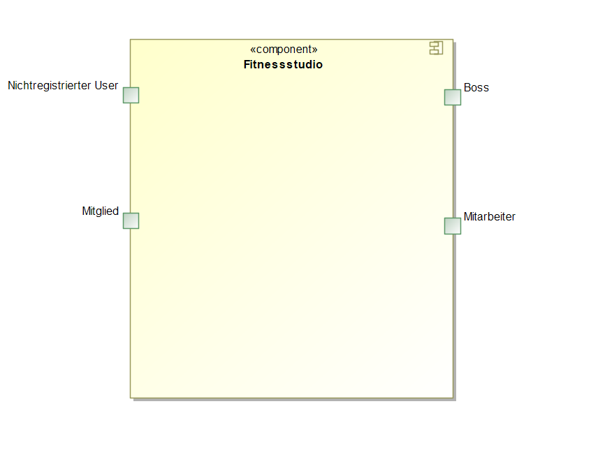

= Pflichtenheft
:project_name: Projektname
== __{project_name}__

[options="header"]
[cols="1, 1, 1, 1, 4"]
|===
|Version | Status      | Bearbeitungsdatum   | Autoren(en) |  Vermerk
|0.1     | abgeschlossen   | 08.11.2020          | Nils       | Initiale Version
|0.1.1     | abgeschlossen   | 08.11.2020          | Justus       | Formatierung angepasst
|0.1.2     | abgeschlossen   | 08.11.2020          | Justus       | Erste GUI-Bilder hinzugefügt
|0.1.3 | abgeschlossen | 12.11.2020 | Daniel | Neue Punkte hinzugefügt
|0.1.4 | abgeschlossen | 13.11.2020 | Justus | Sequenzdiagramme für Mitgliedsbeitrag erstellen und Lagerbestand abrufen hinzugefügt
|0.1.5 | abgeschlossen | 14.11.2020 | Daniel | Analyseklassendiagramm und Klassenbeschreibung hinzugefügt
|0.1.5.1 | abgeschlossen | 14.11.2020 | Daniel | Formatierungsfehler behoben
|0.1.6 | abgeschlossen | 14.11.2020 | Alex | Vervollständigung der Auflistung von Anwendungsfällen
|0.1.7 | abgeschlossen | 15.11.2020 | Alex | Hinzufügen von Use Case diagramm + Umstrukturierung von Use Cases
|0.1.8 | abgeschlossen | 15.11.2020 | Nils | Überarbeitung des GUI-Prototypen
|0.1.9 | abgeschlossen | 15.11.2020 | Sebastian | Hinzufügen von Sequenzdiagrammen, Akzeptanztestfälle
|1.0 | abgeschlossen | 15.11.2020 | Daniel | Vorläufige finale Version
|1.1 | abgeschlossen | 17.11.2020 | Justus | Muss-Kriterien ausführlicher beschrieben
|1.2 | abgeschlossen | 17.11.2020 | Daniel | Use-Cases ausformuliert
|===

:author: Nils, Alexander, Yaoxin, Daniel, Sebastian, Justus
:revnumber: 1.2
:revdate: {docdatetime}
:revremark: Work in Progress
:doctype: book
:icons: font
:source-highlighter: highlightjs
:toc: left
:numbered:

== Zusammenfassung

Entstehen soll eine Webanwendung für ein Fitnessstudio, die Mitarbeitern, Mitgliedern, sowie normalen Nutzern eine Vielzahl von Möglichkeiten gibt ihre Aufgaben wahrzunehmen.
Unregistrierte Nutzer verfügen über die Möglichkeit sich zu registrieren und Mitglied zu werden.
Ein Shop soll das Erwerben von Produkten ermöglichen und durch die Mitarbeiter verwaltbar sein.
Alle Aktivitäten der Kunden sollen in ihrem Benutzeraccount einsehbar sein. Des Weiteren können dort Änderungen an persönlichen Daten vorgenommen werden.
Die Mitarbeiter werden in der Lage sein, die Mitglieder zu verwalten, wobei sie selbst vom Boss verwaltet werden können.

== Aufgabenstellung und Zielsetzung

Fitnessstudio
Es soll eine Software für den Einsatz in einem Fitnessstudio entwickelt werden.
Dabei sollen verschiedene Geschäftsfelder berücksichtigt werden.
In der Mitarbeiterverwaltung können Mitarbeiter des Fitnessstudios eingestellt, bearbeitet
und entlassen werden. Die Mitarbeiter haben verschiedene Aufgaben/Rechte und Löhne.
Für jedes Mitarbeiter wird am Monatsende ein Lohnschein per PDF ausgestellt. Die
Mitarbeiter sollen einen eigenen Login erhalten, um ihre Lohnscheine abzurufen sowie
Urlaubsanträge zu stellen und deren Status einzusehen.
Mitglieder sollen sich über ein Formular anmelden können und nach Abschluss eines
Vertrages als vollwertiges Mitglied aufgenommen werden. Die Mitglieder können von
Mitarbeitern bearbeitet und entlassen werden. Die Mitglieder erhalten nach der Anmeldung einen Account sich einzuloggen. In ihrem Account können sie ihre persönlichen Daten anpassen und ihre monatlichen Vorgänge des Kundenkontos per PDF
ausgeben lassen.

Des Weiteren gibt es im Studio einen Eingangs- und Verkaufsbereich. Dort meldet sich
jedes Mitglied bei Betreten des Studios an und bei Verlassen ab. An der Theke können
auch Getränke, Nahrungsergänzungsmittel oder Zubehör erworben werden, diese
werden bar bezahlt oder direkt vom Kundenkonto abgebucht. Diese Artikel sollen in der
monatlichen Rechnung mit ersichtlich sein, falls sie vom Kundenkonto abgebucht werden.
Die Mitglieder können ihr Kundenkonto in ihrem Account per Überweisung aufladen. Der
monatliche Mitgliedsbeitrag wird vom Kundenkonto abgebucht. Wirbt ein Mitglied ein
neues Mitglied wird ihm ein bestimmter Betrag auf sein Kundenkonto gutgeschrieben.
Eine Mitgliedschaft kann pro Jahr für einen Monat ohne Gründe ausgesetzt werden.
Die Artikel des Verkaufsbereiches müssen sich ebenfalls verwalten lassen. Es
müssen Artikel hinzugefügt, bearbeitet und gelöscht werden können. Bei
unterschreiten der Mindestmenge müssen die Artikel auf eine Nachbestellliste
eingetragen werden welche sich als PDF ausgeben lassen soll. Artikel die für den
Verzehr gedacht sind, haben ein Verfallsdatum. Die Nachbestellliste sowie die
Überprüfung des Mindesthaltbarkeitsdatums sollen per Knopfdruck angestoßen werden
können. Für verschiedene Artikel soll man für einen bestimmten Zeitraum einen Rabatt
angeben können.

Ebenfalls sollen Statistiken über laufende Kosten, Einnahmen, Kundenverhalten und
Verkaufsartikel grafisch dargestellt werden. Verschiedene Einstellungen wie
Vertragslaufzeit, monatliche Gebühren, Neuwerbungsprämie, Öffnungszeiten usw. sollen
sich einfach global verändern lassen.

Das System wird verwendet, um die Beziehung zu Kunden zu vereinfachen, sodass sich 
Kunden bequem über die Website registrieren, persönliche Informationen verwalten und 
es Managern bequem machen können, das Fitnessstudio zu verwalten. Das neue IT-System 
soll seinen Geschäftskunden einen Wettbewerbsvorteil verschaffen.

== Produktnutzung

* Es soll eine Webanwendung / Webseite für ein Fitnessstudio entstehen
* Diese soll dem Fitnessstudio zur Verfügung stehen um Verwaltungsaufgaben zu ermöglichen
* Fungiert als permanente Webpräsenz für das Fitnessstudio
* Wird genutzt von den Mitgliedern und den Mitarbeitern des Fitnessstudios im Desktopbetrieb
* Die Webanwendung soll auf allen gängigen Browsern laufen
* Alle Daten werden in einer Datenbank gespeichert und können über die Webanwendung abgerufen werden

== Interessensgruppen (Stakeholders)

// See http://asciidoctor.org/docs/user-manual/#tables
[options="header"]
|===
|Name |Priorität(1-5) |Beschreibung |Ziele
|Kunde/Boss |5 |Auftraggeber des Projektes | *Weboberfläche, *dezentrale Verwaltung von Mitarbeitern, Finanzen, Webpräsenz
|Mitglieder |4 |Hauptnutzer, sorgen für Einkommen | Einfach verwaltbares Benutzerkonto
|Mitarbeiter |3 |Nutzer der Anwendung | Einreichen von Urlaubsanträgen, Verwaltung des Shops, Mitgliederverwaltung, Lohneinsicht
|Entwickler |2 |Verantwortlich für Entwicklung, sowie Instandhaltung und Erweiterung in Zukunft | einfach erweiterbare Anwendung, Wartung mit geringem Aufwand
|===

== Systemgrenze und Top-Level-Architektur

[[Kontextdiagramm]]

=== Top-Level-Architektur

[[Top_Level_Diagramm]]
image::./images/Top_Level_Diagramm.PNG[Sequence diagram: View Catalog, 100%, 100%, pdfwidth=100%, title= "Top Level Architektur Diagramm", align=center]

== Anwendungsfälle

=== Akteure

Dieser Abschnitt gibt einen Überblick über die Anwendungsfälle, die das System unterstützen muss. Diese Anwendungsfälle beschreiben aus sicht des Nutzers,
welche Funktionen das System bieten muss und wer dabei beteiligt ist.

// See http://asciidoctor.org/docs/user-manual/#tables
[options="header"]
[cols="1,4"]
|===
|Name |Beschreibung
|Mitglied  |Verwendet den Shop und verwaltet seinen Account
|Mitarbeiter  |Verwaltet die Mitglieder und stellt den Produktnachschub sicher
|Boss  |Verwaltet die Mitarbeiter und hat alle Privilegien um das Studio zu verwalten
|Nichtregistrierter User  |Kann sich auf Webseite umschauen, kann sich Registrieren
|===

=== Überblick Anwendungsfalldiagramm
Anwendungsfall-Diagramm, das alle Anwendungsfälle und alle Akteure darstellt

[[Anwendungsfalldiagramm]]

=== Anwendungsfallbeschreibungen

==== Studiomanagement

[cols="1h, 3"]
|===
|Name                       |Öffnungszeit bearbeiten
|Beschreibung                |Manager soll Öffnungszeiten bearbeiten können
|Akteur                     |Manager
|Auslöser                    |Manager drückt auf "Studio verwalten"
|Voraussetzungen           a|ist als Manager eingeloggt
|Essentielle Schritte           a|
1.  Manager klickt auf den Knopf "Verwaltung"
2.  Manager klickt auf Studio verwalten
3.  Manager ändert Öffnungszeiten
|Erweiterungen                 |-
|Funktionale Voraussetzungen    |-
|===

[cols="1h, 3"]
|===
|Name                       |Anwerbebonus anpassen
|Beschreibung                |Manager soll Anmeldebonus bearbeiten können
|Akteur                     |Manager
|Auslöser                    |Manager drückt auf "Studio verwalten"
|Voraussetzungen           a|ist als Manager eingeloggt
|Essentielle Schritte           a|
1.  Manager klickt auf den Knopf "Verwaltung"
2.  Manager klickt auf Studio verwalten
3.  Manager ändert Anmeldebonus
|Erweiterungen                 |-
|Funktionale Voraussetzungen    |-
|===

[cols="1h, 3"]
|===
|Name                       |Urlaubsantrag bearbeiten
|Beschreibung                |Manager soll Urlaubsantrag bearbeiten können
|Akteur                     |Manager
|Auslöser                    |Manager drückt auf "Anträge verwalten"
|Voraussetzungen           a|ist als Manager eingeloggt
|Essentielle Schritte           a|
1.  Manager klickt auf den Knopf "Verwaltung"
2.  Manager klickt auf Anträge verwalten
3.  Manager kann Urlaubsanträge der Mitarbeiter annehmen oder ablehnen
|Erweiterungen                 |-
|Funktionale Voraussetzungen    |-
|===

[cols="1h, 3"]
|===
|Name                       |Mitarbeiter einstellen
|Beschreibung                |Manager soll Mitarbeiter einstellen können
|Akteur                     |Manager
|Auslöser                    |Manager drückt auf "Mitarbeiter verwalten"
|Voraussetzungen           a|ist als Manager eingeloggt
|Essentielle Schritte           a|
1.  Manager klickt auf den Knopf "Verwaltung"
2.  Manager klickt auf Mitarbeiter verwalten
3.  Manager klickt auf Mitarbeiter hinzufügen
4.  Manager füllt das Formular zur Einstellung aus
5.  Manager schickt das Formular ab
|Erweiterungen                 |-
|Funktionale Voraussetzungen    |-
|===

[cols="1h, 3"]
|===
|Name                       |Mitarbeiter feuern
|Beschreibung                |Manager soll Mitarbeiter feuern können
|Akteur                     |Manager
|Auslöser                    |Manager drückt auf "Mitarbeiter verwalten"
|Voraussetzungen           a|ist als Manager eingeloggt
|Essentielle Schritte           a|
1.  Manager klickt auf den Knopf "Verwaltung"
2.  Manager klickt auf Mitarbeiter verwalten
3.  Manager wählt Mitarbeiter in der Mitarbeitertabelle
4.  Manager drückt auf "Entlassen"
|Erweiterungen                 |-
|Funktionale Voraussetzungen    |-
|===

==== Nutzerverwaltung
[cols="1h, 3"]
|===
|Name                       |Nutzer abmelden
|Beschreibung                |Nutzer soll sich abmelden können
|Akteur                     |User
|Auslöser                    |User drückt auf "abmelden"
|Voraussetzungen           a|ist als User eingeloggt
|Essentielle Schritte           a|
1.  User klickt auf den Knopf "Abmelden"
|Erweiterungen                 |-
|Funktionale Voraussetzungen    |-
|===

[cols="1h, 3"]
|===
|Name                       |Account aufladen
|Beschreibung                |User soll sein Konto aufladen können
|Akteur                     |User
|Auslöser                    |User drückt auf sein Guthaben
|Voraussetzungen           a|ist als User eingeloggt
|Essentielle Schritte           a|
1.  User klickt auf sein Guthaben
2.  User klickt auf Konto aufladen
3.  User füllt Formular für die Aufladung aus
4.  User schickt das Formular ab
|Erweiterungen                 |-
|Funktionale Voraussetzungen    |-
|===

[cols="1h, 3"]
|===
|Name                       |Persönliche Daten anpassen
|Beschreibung                |User soll seine pers. Daten anpassen können
|Akteur                     |User
|Auslöser                    |User drückt auf "Profil bearbeiten"
|Voraussetzungen           a|ist als User eingeloggt
|Essentielle Schritte           a|
1.  User klickt auf den Knopf "Verwaltung"
2.  User klickt auf Profil bearbeiten
3.  User ändert die gewünschten Daten
4.  User klickt auf speichern
|Erweiterungen                 |-
|Funktionale Voraussetzungen    |-
|===

[cols="1h, 3"]
|===
|Name                       |Vertragspause anfragen
|Beschreibung                |User soll eine Vertragspause für einen Monat anfragen können
|Akteur                     |User
|Auslöser                    |User drückt auf "Anträge verwalten"
|Voraussetzungen           a|ist als User eingeloggt
|Essentielle Schritte           a|
1.  User klickt auf den Knopf "Verwaltung"
2.  User klickt auf Anträge verwalten
3.  User klickt auf Antrag hinzufügen
4.  User wählt Mitgliedschaft pausieren
5.  User wählt Zeitraum der Pausierung
6.  User schickt Antrag ab
|Erweiterungen                 |-
|Funktionale Voraussetzungen    |-
|===

[cols="1h, 3"]
|===
|Name                       |Vertragspause bearbeiten
|Beschreibung                |Mitarbeiter soll Pausierungsantrag annehmen oder ablehnenkönnen
|Akteur                     |Mitarbeiter
|Auslöser                    |Mitarbeiter drückt auf "Anträge verwalten"
|Voraussetzungen           a|ist als Mitarbeiter eingeloggt
|Essentielle Schritte           a|
1.  Mitarbeiter klickt auf den Knopf "Verwaltung"
2.  Mitarbeiter klickt auf Anträge verwalten
3.  Mitarbeiter akzeptiert/lehnt den Vertrag ab 
|Erweiterungen                 |-
|Funktionale Voraussetzungen    |-
|===

[cols="1h, 3"]
|===
|Name                       |Rechnung abfragen
|Beschreibung                |User soll seine Rechnungen abfragen können
|Akteur                     |User
|Auslöser                    |User drückt auf "Profil bearbeiten"
|Voraussetzungen           a|ist als User eingeloggt
|Essentielle Schritte           a|
1.  User klickt auf den Knopf "Verwaltung"
2.  User klickt auf Profil bearbeiten
3.  User klickt auf "Rechnung.pdf"
|Erweiterungen                 |-
|Funktionale Voraussetzungen    |-
|===

[cols="1h, 3"]
|===
|Name                       |Urlaubsantrag stellen
|Beschreibung                |Mitarbeiter soll einen Urlaubsantrag stellen können
|Akteur                     |Mitarbeiter
|Auslöser                    |Mitarbeiter drückt auf "Anträge verwalten"
|Voraussetzungen           a|ist als Mitarbeiter eingeloggt
|Essentielle Schritte           a|
1.  Mitarbeiter klickt auf den Knopf "Verwaltung"
2.  Mitarbeiter klickt auf Anträge verwalten
3.  Mitarbeiter klickt auf Antrag hinzufügen
4.  Mitarbeiter wählt Urlaubsantrag stellen aus
5.  Mitarbeiter wählt Zeitraum des Urlaubs aus
6.  Mitarbeiter schickt Antrag ab
|Erweiterungen                 |-
|Funktionale Voraussetzungen    |-
|===

[cols="1h, 3"]
|===
|Name                       |Lohnabrechnung abfragen
|Beschreibung                |Mitarbeiter soll seine Lohnabrechnung abfragen können
|Akteur                     |Mitarbeiter
|Auslöser                    |Mitarbeiter drückt auf "Profil bearbeiten"
|Voraussetzungen           a|ist als Mitarbeiter eingeloggt
|Essentielle Schritte           a|
1.  Mitarbeiter klickt auf den Knopf "Verwaltung"
2.  Mitarbeiter klickt auf Profil bearbeiten
3.  Mitarbeiter klickt "Lohnabrechnung.pdf"
|Erweiterungen                 |-
|Funktionale Voraussetzungen    |-
|===

[cols="1h, 3"]
|===
|Name                       |Nutzer bearbeiten
|Beschreibung                |Mitarbeiter soll Nutzer bearbeiten können
|Akteur                     |Mitarbeiter
|Auslöser                    |Mitarbeiter drückt auf "Mitglieder verwalten"
|Voraussetzungen           a|ist als Mitarbeiter eingeloggt
|Essentielle Schritte           a|
1.  Mitarbeiter klickt auf den Knopf "Verwaltung"
2.  Mitarbeiter klickt auf Mitglieder verwalten
3.  Mitarbeiter klickt auf Mitglied in der Liste
4.  Mitarbeiter ändert den gewünschten Punkt
|Erweiterungen                 |-
|Funktionale Voraussetzungen    |-
|===

[cols="1h, 3"]
|===
|Name                       |Vertrag verlängern
|Beschreibung                |User soll seinen Mitgliedschaftverlängern können
|Akteur                     |User
|Auslöser                    |User drückt auf "Anträge verwalten"
|Voraussetzungen           a|ist als User eingeloggt
|Essentielle Schritte           a|
1.  User klickt auf den Knopf "Verwaltung"
2.  User klickt auf Anträge verwalten
3.  User klickt auf Mitgliedschaftg verlängern
|Erweiterungen                 |-
|Funktionale Voraussetzungen    |-
|===

[[Benutzerlogin]]

[[UC0100]]
[cols="1h, 3"]
|===
|ID                         |**<<UC0100>>**
|Name                       |Benutzerlogin
|Beschreibung                |Benutzer soll sich in seinen vorhandenen Account einloggen können
|Akteur                     |Benutzer
|Auslöser                    |Benutzer drückt auf "Einloggen" in der Navigationsleiste
|Voraussetzungen           a|Benutzer besitzt einen Account
|Essentielle Schritte           a|
1.  Benutzer klickt auf den Knopf "Einloggen"
2.  Benutzer wird auf "login.html" weitergeleitet
3.  Benutzer gibt seine Anmeldedaten ein und drück auf auf "Einloggen"
|Erweiterungen                 |-
|Funktionale Voraussetzungen    |-
|===

[[Benutzerregistrierung]]

[[UC0200]]
[cols="1h, 3"]
|===
|ID                         |**<<UC0200>>**
|Name                       |Benutzerregistrierung
|Beschreibung                |Benutzer soll einen Account erstellen können
|Akteur                     |Benutzer
|Auslöser                    |Benutzer drückt auf "Registrieren" in der Navigationsleiste
|Voraussetzungen           a|Benutzer ist nicht angemeldet
|Essentielle Schritte           a|
1.  Benutzer klickt auf den Knopf "Registrieren"
2.  Benutzer wird auf "register.html" weitergeleitet
3.  Benutzer gibt seine Daten ein und drück auf auf "Registrieren"
4.  Es wird ein Account in der Datenbank angelegt
|Erweiterungen                 |-
|Funktionale Voraussetzungen    |-
|===

[[Mitgliedsantrag_erstellen]]

[[UC0300]]
[cols="1h, 3"]
|===
|ID                         |**<<UC0300>>**
|Name                       |Mitgliedsantrag erstellen
|Beschreibung                |Benutzer soll einen Mitgliedsantrag erstellen können
|Akteur                     |Benutzer
|Auslöser                    |Benutzer drückt auf "Mitgliedsantrag erstellen" in seiner Kontoverwaltung
|Voraussetzungen           a|Benutzer ist in Kontoverwaltung
|Essentielle Schritte           a|
1.  Benutzer klickt auf den Knopf "Mitgliedsantrag erstellen"
2.  Benutzer wird das Formular zur Antragserstellung angezeigt
3.  Benutzer drückt auf "Antrag absenden"
|Erweiterungen                 |-
|Funktionale Voraussetzungen    |-
|===

==== Shopverwaltung

[cols="1h, 3"]
|===
|Name                       |Produkt hinzufügen
|Beschreibung                |Manager soll ein Produkt zum Shop hinzufügen können
|Akteur                     |Manager
|Auslöser                    |Manager drückt auf "Shop verwalten"
|Voraussetzungen           a|ist als Manager eingeloggt
|Essentielle Schritte           a|
1.  Manager klickt auf den Knopf "Verwaltung"
2.  Manager klickt auf Shop verwalten
3.  Manager klickt auf Produkt hinzufügen
4.  Manager passt die Parameter für das neue Produkt an
5.  Manager bestätigt das Formular
|Erweiterungen                 |-
|Funktionale Voraussetzungen    |-
|===

[cols="1h, 3"]
|===
|Name                       |Produkt entfernen
|Beschreibung                |Manager soll ein Produkt aus dem Shop entfernen können
|Akteur                     |Manager
|Auslöser                    |Manager drückt auf "Shop verwalten"
|Voraussetzungen           a|ist als Manager eingeloggt
|Essentielle Schritte           a|
1.  Manager klickt auf den Knopf "Verwaltung"
2.  Manager klickt auf Shop verwalten
3.  Manager klickt auf Produkt entfernen
|Erweiterungen                 |-
|Funktionale Voraussetzungen    |-
|===

[cols="1h, 3"]
|===
|Name                       |Nachbestellliste abfragen
|Beschreibung                |Manager soll die Nachbestellliste abfragen können
|Akteur                     |Manager
|Auslöser                    |Manager drückt auf "Shop verwalten"
|Voraussetzungen           a|ist als Manager eingeloggt
|Essentielle Schritte           a|
1.  Manager klickt auf den Knopf "Verwaltung"
2.  Manager klickt auf Shop verwalten
3.  Manager klickt auf "Nachbestellliste.pdf"
|Erweiterungen                 |-
|Funktionale Voraussetzungen    |-
|===

[cols="1h, 3"]
|===
|Name                       |Mindesthaltbarkeitsdatum prüfen
|Beschreibung                |Manager soll ein Produkt auf MhD prüfen können
|Akteur                     |Manager
|Auslöser                    |Manager drückt auf "Shop verwalten"
|Voraussetzungen           a|ist als Manager eingeloggt
|Essentielle Schritte           a|
1.  Manager klickt auf den Knopf "Verwaltung"
2.  Manager klickt auf Shop verwalten
3.  Manager klickt auf Mindesthaltbarkeitsdatum prüfen
4.  System fügt ablaufende Produkte zu Nachbestellliste hinzu
|Erweiterungen                 |-
|Funktionale Voraussetzungen    |-
|===

[cols="1h, 3"]
|===
|Name                       |Rabatte festlegen
|Beschreibung                |Manager soll einen Rabatt für ein Produkt hinzufügen können
|Akteur                     |Manager
|Auslöser                    |Manager drückt auf "Shop verwalten"
|Voraussetzungen           a|ist als Manager eingeloggt
|Essentielle Schritte           a|
1.  Manager klickt auf den Knopf "Verwaltung"
2.  Manager klickt auf Shop verwalten
3.  Manager klickt auf ein Produkt
4.  Manager trägt Rabatt in Formular ein
5.  Manager bestätigt Formular
|Erweiterungen                 |-
|Funktionale Voraussetzungen    |-
|===

[[Lagerbestand_abfragen]]

[[UC0400]]
[cols="1h, 3"]
|===
|ID                         |**<<UC0400>>**
|Name                       |Lagerbestand abfragen
|Beschreibung                |Manager fragt Lagerbestand ab und erhält diesen als Liste
|Akteur                     |Manager
|Auslöser                    |Manager drückt in der Studioverwaltung auf "Lagerbestand abfragen"
|Voraussetzungen           a|Manager ist in Studioverwaltung
|Essentielle Schritte           a|
1.  Manager klickt auf den Knopf "Lagerbestand abfragen"
2.  Dem Manager wird der Lagerbestand als Liste angezeigt
|Erweiterungen                 |-
|Funktionale Voraussetzungen    |-
|===

Disclaimer: Es handelt sich bei den aufgezeigten Sequenzdiagrammen nur um einen Auszug der finalen Menge an Anwendungsfällen.

== Funktionale Anforderungen

=== Muss-Kriterien

==== Anmeldung

[options="header", cols="2h, 1, 3, 12"]
|===
|ID
|Version
|Name
|Beschreibung

|[[F0110]]<<F0110>>
|v0.1
|Authentifizierung
a|
Das System sollte in öffentlich erreichbare und durch Authentifizierung geschütze Teile unterteilt sein. Wenn ein Nutzer vorhanden ist sollte er sich durch die angabe folgender Daten anmelden können:

* Nutzername
* Passwort

|[[F0120]]<<F0120>>
|v0.1
|Registrierung
a|
Das System sollte Nutzern die Möglichkeit bieten sich zu registrieren.

Dafür sind folgende Daten notwendig:

* Nutzername
* Passwort
* E-Mail

Das System soll diese Daten auf Zulässigkeit (Nutzername noch nicht vergeben, Aufbau E-Mail-Adresse) überprüfen. Danach soll der Nutzer in der Lage sein sich anzumelden.

|[[F0130]]<<F0130>>
|v0.1
|Nutzerkonto
a|
Das System soll jedem Nutzer ein Nutzerkonto bereitstellen, in dem folgende Daten abgespeichert werden:
- Nutzername
- Passwort
- E-Mail

Zusätzlich für Mitglieder:
- Vorname
- Nachname
- Adresse
- getätigte Bestellungen
- Guthaben
- Status der Mitgliedschaft
- Status der grundlosen Pausierung

|[[F0140]]<<F0140>>
|v0.1
|Nutzerdaten bearbeiten
a|
Das System soll Nutzern die Möglichkeit bieten ihre Nutzerdaten zu bearbeiten.

|[[F0150]]<<F0150>>
|v0.1
|Kundenkonto aufladen
a|
Das System soll Mitarbeitern die Möglichkeit bieten das Guthaben von Mitgliedern aufzuladen. Dies passiert auf Grund von Barzahlung oder Überweisung an das Fitnessstudio. Dabei wird die Angabe des aufzuladenden Betrags benötigt.

|[[F0160]]<<F0160>>
|v0.1
|Neuwerbungsprämie
a|
Das System soll den Mitarbeitern die Möglichkeit bieten Mitgliedern, die andere Kunden geworben haben, eine Neuwerbungsprämie auf das Nutzerkonto gutzuschreiben.
|===

==== Verwaltung

[options="header", cols="2h, 1, 3, 12"]
|===
|ID
|Version
|Name
|Beschreibung

|[[F0210]]<<F0210>>
|v0.1
|Mitgliedsantrag einreichen
a|
Das System soll Nutzern nach der Registrierung die Möglichkeit bieten einen Mitgliedsantrag zur Beantragung einer Mitgliedschaft einzureichen.

Dafür werden folgende Informationen abgefragt:

* Vorname
* Nachname
* Adresse
* E-Mail-Adresse eines Werbers

|[[F0211]]<<F0211>>
|v0.1
|Urlaubsantrag einreichen
a|
Das System soll Mitarbeitern die Möglichkeit bieten einen Urlaubsantrag einzureichen.

Dafür werden folgende Informationen abgefragt:

* Anfangsdatum
* Enddatum

|[[F0212]]<<F0212>>
|v0.1
|Pausierungsantrag einreichen
a|
Das System soll Mitgliedern die Möglichkeit bieten einen Pausierungsantrag zur Aussetzung der Mitgliedschaft einzureichen.

Dafür werden folgende Informationen abgefragt:

* Beantragter Monat
* Grund

|[[F0213]]<<F0213>>
|v0.1
|Anträge bearbeiten
a|
Das System soll Manager (Urlaub) bzw. Mitarbeitern (Mitglied, Pausierung) die Möglichkeit bieten Anträge anzunehmen oder abzulehnen.

Folgende Daten werden abgespeichert:

- Bearbeiter
- Datum

Folgende Informationen werden bei der Ablehnung abgefragt:

* Grund der Ablehnung

|[[F0220]]<<F0220>>
|v0.1
|Mitarbeiter bearbeiten
a|
Das System soll dem Manager die Möglichkeit bieten Mitarbeiter einzustellen, zu bearbeiten oder sie zu entlassen.

Folgende Informationen werden bei der Entlassung abgefragt:

* Grund der Entlassung

|[[F0230]]<<F0230>>
|v0.1
|Lohnschein abrufen
a|
Das System soll den Mitarbeitern die Möglichkeit bieten ihren Lohnschein für vergangene Monate als PDF abrufen zu können.

|[[F0231]]<<F0231>>
|v0.1
|Nachbestellliste abrufen
a|
Das System soll den Mitarbeitern die Möglichkeit bieten eine Nachbestellliste für fehlende Produkte im Shop abzurufen.

|[[F0240]]<<F0240>>
|v0.1
|Öffnungszeiten bearbeiten
a|
Das System soll dem Manager die Möglichkeit bieten die Öffnungszeiten des Fitnessstudios per Schieberegler anzupassen.

|[[F0341]]<<F0341>>
|v0.1
|Mitgliedsbeitrag bearbeiten
a|
Das System soll dem Manager die Möglichkeit bieten den Mitgliedsbeitrag anzupassen. Dabei wird der neue monatliche Preis abgefragt.

|[[F0342]]<<F0342>>
|v0.1
|Neuwerbungsprämie bearbeiten
a|
Das System soll dem Manager die Möglichkeit bieten die Neuwerbungsprämie anzupassen. Dabei wird die neue Höhe abgefragt.
|===

==== Statistiken

[options="header", cols="2h, 1, 3, 12"]
|===
|ID
|Version
|Name
|Beschreibung

|[[F0310]]<<F0310>>
|v0.1
|Kostenübersicht anzeigen
a|
Das System soll dem Manager die Möglichkeit bieten sich eine monatliche Übersicht der Kosten des Fitnessstudios anzeigen zu lassen.

Folgende Daten werden dabei angegeben:

- Name des Postens
- Datum
- Höhe
- Person

|[[F0320]]<<F0320>>
|v0.1
|Finanzübersicht anzeigen
a|
Das System soll dem Manager die Möglichkeit bieten sich eine monatliche Finanzübersicht mit einer Gegenüberstellung der Ausgaben und Einnahmen, sortiert nach Kategorien, anzeigen zu lassen.

|[[F0330]]<<F0330>>
|v0.1
|Besucher anzeigen
a|
Das System soll dem Manager die Möglichkeit bieten sich die monatlichen Besucher der Webseite anzeigen zu lassen.
|===

==== Shop

[options="header", cols="2h, 1, 3, 12"]
|===
|ID
|Version
|Name
|Beschreibung

|[[F0410]]<<F0410>>
|v0.1
|Produkte
a|
Das System soll die Möglichkeit bieten Produkte abzuspeichern.

Die folgenden Daten sollen abgefragt werden:

* Name
* Preis
* Kategorie
* Anzahl

Bei Produkten mit Mindesthaltbarkeitsdatum:

* Mindesthaltbarkeitsdatum
* Anzahl mit diesem Datum

|[[F0411]]<<F0411>>
|v0.1
|Produktdaten bearbeiten
a|
Das System soll die Möglichkeit bieten Anzahl, Preis und Rabatt von Gegenständen im Inventar zu ändern.

|[[F0412]]<<F0412>>
|v0.1
|Produktdaten anzeigen
a|
Das System soll in der Lage sein Daten (Anzahl, Mindesthalbarkeitsdatum) zu einzelnen Produkten anzuzeigen.

|[[F0413]]<<F0413>>
|v0.1
|Produktanzahl überprüfen
a|
Das System soll in der Lage sein zu überprüfen, ob bei Bestellung noch eine ausreichende Anzahl im Lager vorhanden ist.

|[[F0420]]<<F0420>>
|v0.1
|Lagerbestand
a|
Das System soll die im Shop verfügbaren Waren abspeichern können.

|[[F0421]]<<F0421>>
|v0.1
|Lagerbestand anzeigen lassen
a|
Das System soll dem Manager die Möglichkeit bieten den Lagerbestand abzurufen.

Die folgen Informationen sollen dabei angezeigt werden:
- Produkt
- Anzahl
- ggf. Mindesthaltbarkeitsdatum

|[[F0430]]<<F0430>>
|v0.1
|Warenkorb
a|
Das System soll in der Lage sein einen Warenkorb anzulegen.

|[[F0431]]<<F0431>>
|v0.1
|Produkte in Warenkorb legen
a|
Das System soll in der Lage sein Produkte in den Warenkorb zu legen.

|[[F0432]]<<F0432>>
|v0.1
|Warenkorb kaufen
a|
Das System soll die Möglichkeit bieten einen Warenkorb zu kaufen.

|[[F0440]]<<F0440>>
|v0.1
|Bestellungen abspeichern
a|
Das System soll in der Lage sein Verkäufe abzuspeichern.

Dabei werden folgende Informationen gespeichert:

- Artikel
- Anzahl
- Käufer
- Gesamtsumme
- Datum

|[[F0450]]<<F0450>>
|v0.1
|Kunden anzeigen
a|
Das System soll die Möglichkeit bieten alle Kunden anzeigen zu lassen.

Dabei werden folgende Informationen angezeigt:

- Kunde
- Bestellungen
- Summe Bestellungen im letzten Monat

|[[F0451]]<<F0451>>
|v0.1
|Bestellungen anzeigen lassen
a|
Das System soll dem Manager die Möglichkeit bieten sich alle abgeschlossenen Bestellungen anzeigen zu lassen.

Die folgen Informationen sollen für die Bestellungen angezeigt werden:

- Zeitpunkt
- Kunde
- Preis

|[[F0452]]<<F0452>>
|v0.1
|Haltbarkeitsdatum überprüfen
a|
Das System soll die Möglichkeit bieten sich Produkte mit bald ablaufendem Mindesthaltbarkeitsdatum anzeigen zu lassen.
|===

=== Kann-Kriterien

* Forum (Posten von Beiträgen, durch Mitarbeiter und Mitglieder, vllt. Ankündigungen vom Boss)
* Online-Interface für Shop

== Nicht-Funktionale Anforderungen

=== Qualitätsziele (Prioritäten: 1-5, 5 ist Maximum)

// See http://asciidoctor.org/docs/user-manual/#tables
[options="header"]
|===
|Priorität |Stichwort |Beschreibung
|5 |Funktionalität | alle geforderten Funktionen sind ausführbar
|4 |Zuverlässigkeit | Das System muss ohne große Fehler durchgehend laufen
|3 |Nutzbarkeit | Für alle Stakeholders nutzbar
|1 |Effizienz | läuft ressourcenoptimiert
|4 |Wartbarkeit | leicht wartbar
|2 |Kompatibilität/Flexibilität | Kompatibel mit allen Browsern
|===

== GUI Prototyp

Die folgenden Bilder zeigen wie eine GUI aussehen könnte.

[[Startseite]]

[[Öffnungszeiten]]
image::./images/gui/Öffnungszeiten.jpg[Nutzer_Dropdown, 100%, 100%, pdfwidth=100%, title= "Öffnungszeiten des Fitnessstudios", align=center]

[[Bilder]]

[[Login]]

[[Account_verwalten]]

[[Profil]]

[[Mitarbeiter_verwalten]]

[[Mitglieder_verwalten]]

[[Shop_verwalten]]

[[Anträge_verwalten]]
image::./images/gui/Anträge_verwalten.jpg[Studioverwaltung, 100%, 100%, pdfwidth=100%, title= "Antragsverwaltung", align=center]

[[Studio_verwalten]]

== Datenmodell

=== Überblick: Klassendiagramm

[[Analyseklassendiagramm]]
image::./images/Analyseklassendiagramm.jpg[Analyseklassendiagramm, 100%, 100%, pdfwidth=100%, title= "Analyseklassendiagramm", align=center]

=== Klassen und Enumerationen

// See http://asciidoctor.org/docs/user-manual/#tables
[options="header"]
|===
| Klasse/Enumeration | Beschreibung
| Fitnessstudio            | Zentrale Klasse, die das Fitnessstudio repräsentiert
| ApplicationManagement | Kennt alle Anfragen und kann diese verwalten.
| Request | Repräsentiert die Oberklasse aller Anfragen und hat verschiedene Attribute, wie Bearbeitungs- und Ausfülldatum, Status, und von wem die Anfrage ausgefüllt wurde.
| Application | Erstellung eines Mitgliedsantrags
| PauseRequest | Eine mögliche Anfrage, die zur Aussetzung des Mitgliedsvertrages für einen Monat dient.
| Contract | Mitgliedsvertrag eines Mitglieds im Fitnessstudio, der den Zeitraum, einen Preis und eine Beschreibung enthält.
| User | Generelle Repräsentation eines Mitgliedes im System. Diese wird nur erstellt, wenn man sich im System registriert.
| Employee | Repräsentation der Mitarbeiter des Studios. Muss vom Manager eingestellt werden.
| Manager | Chef des Systems, der Urlaubsanträge verwalten, Mitarbeiter bearbeiten kann und Zugriff auf den Bestand des Shops hat
| VacationRequest | Ein Antrag für Mitarbeiter um Urlaub zu erhalten
| ProductManagement | Kennt die Produkte im Shop und kann ihre Attribute verwalten und Neubestellungen anregen
| Shop | Klasse zur Repräsentation aller Objekte im Shop und zur Verwaltung, was im Shop angeboten wird
| Product | Konkretes Objekt im Shop
| Supplements | Spezielles Objekt im Shop, welches zusätzlich ein Mindesthaltbarkeitsdatum hat
|===

== Akzeptanztestfälle

Mithilfe von Akzeptanztests wird geprüft, ob die Software die funktionalen Erwartungen und Anforderungen im Gebrauch erfüllt.
Jeder Testfall ist mit einer ID versehen , um später zwischen den Dokumenten (z.B. im Test-Plan) referenzieren zu können.

Disclaimer: Es handelt sich bei den aufgezeigten Testfällen nur um einen Auszug der finalen Menge an Akzeptanztestfällen.

:Pre: Voraussetzungen
:Event: Event
:Result: Zu erwartendes Ergebnis

[cols="1h, 4"]
|===
|ID            |<<AT0100>>
|Anwendungsfall      |<<UC0100>>
|{Pre}        a|Ein Benutzer ist nicht angemeldet und besitzt einen Account
|{Event}      a|Benutzer klickt auf "Login", füllt das Formular aus und schickt es über "Anmelden" ab
|{Result}     a|
- Die Eingegebenen Daten werden mit der Datenbank abgeglichen
- Der Benutzer ist bei korrekten Daten angemeldet, ansonsten bleibt er unangemeldet
|===

[cols="1h, 4"]
|===
|ID            |<<AT0200>>
|Anwendungsfall      |<<UC0200>>
|{Pre}        a|Ein Benutzer ist nicht angemeldet und möchte einen Account erstellen
|{Event}      a|Benutzer klickt auf "Registrieren" , füllt das Formular aus und schickt es über "Registrierung abschließen" ab
|{Result}     a|
Die eingegebenen Daten werden mit der Datenbank abgeglichen:
- Wenn noch kein Account mit der angegebenen E-Mailadresse existiert, dann wird ein Account erstellt und der Benutzer auf "index.html" weitergeleitet
- Wenn die E-Mail Adresse bereits existiert, wird eine entsprechende Fehlermeldung ausgegeben.
|===

[cols="1h, 4"]
|===
|ID            |<<AT0300>>
|Anwendungsfall      |<<UC0300>>
|{Pre}        a|Ein Benutzer hat sich angemeldet und ist in der Kontoverwaltung
|{Event}      a|Benutzer öffnet Kontoverwaltung, klickt auf "Mitgliedsantrag erstellen", füllt das Formular aus und schickt es über "Antrag absenden" ab
|{Result}     a|
- Ein Mitgliedsantrag wurde an das ApplicationManagement geschickt
- Dieser kann vom Manager angenommen oder abgelehnt werden
|===

[cols="1h, 4"]
|===
|ID            |<<AT0400>>
|Anwendungsfall      |<<UC0400>>
|{Pre}        a|Der Manager hat sich mit seinem Account angemeldet und ist in der Studioverwaltung
|{Event}      a|Manager klickt auf "Lagerbestand abfragen"
|{Result}     a|
- Dem Manager wird eine Liste mit dem Lagerbestand angezeigt
|===

== Glossar

[options="header"]
|===
|Begriff |Erklärung
|Kunde                  |Auftraggeber des Projekts
|Boss/Manager | Chef des Fitnesssstudios
|GUI  | Graphical User Interface
|Supplements  | Alle zum Verzehr geeigneten Produkte
|Affiliate  | Prämie die ein Mitglied für das werben eines neuen Mitgliedes erhält
|Mindesthaltbarkeitsdatum | Manche Produkte im Shop wie Müsliriegel haben ein Mindesthaltbarkeitsdatum
|===
